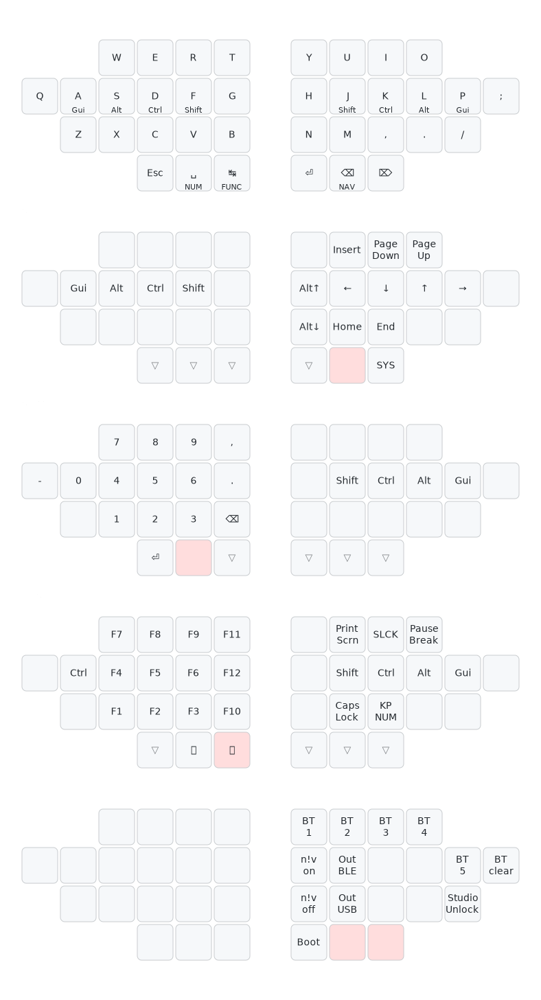

# zmk-molekula

Shield and default keymap for [Molekula2](https://github.com/zzeneg/molekula).

Supports ZMK Studio.

## Default keymap

SVG generated by [keymap-drawer](https://github.com/caksoylar/keymap-drawer)

